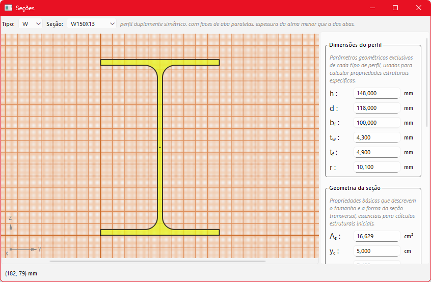
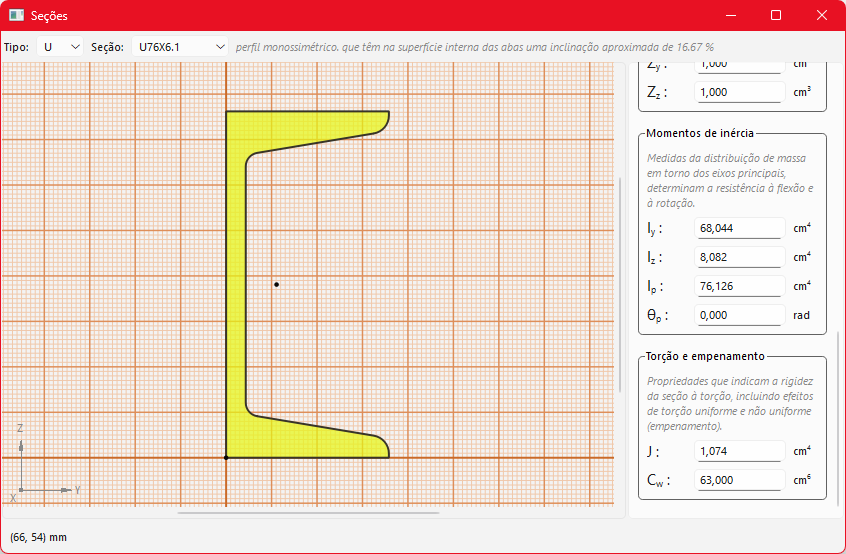
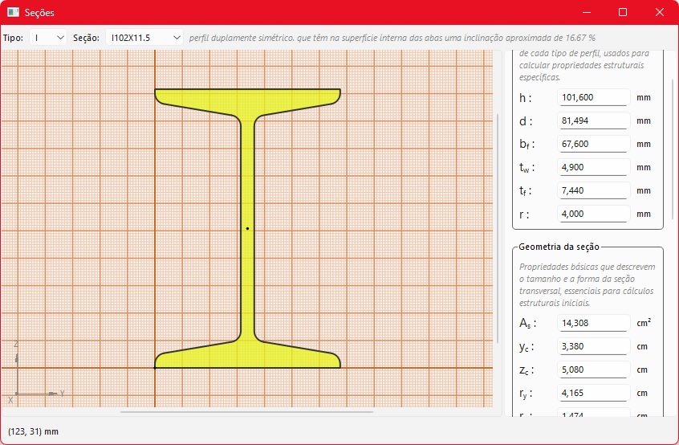

# 🚀 Biblioteca de Seções Metálicas Brasileiras

Uma ferramenta em Python e PyQt6 para mostrar de forma prática várias propriedades de seções metálicas brasileiras.
Todas as propriedades foram calculadas usando o Software PropSection 1.0.4

---

## ✨ Funcionalidades
- ✅ Desenho das seções transversais de perfis I, W, U...
- ✅ Mostra diversas propriedades das seções como área, momentos de inércia, constante de torção...
- ✅ É uma ferramenta apenas para visualização, não calcula as propriedades e não permite editar as seções dentro do programa.
- ✅ Vem acompanhado com um arquivo CSV, para leitura dos dados
- ✅ No módulo exportar.py está o códico para exportar uma seção para o formato .cont que serve para abrir com o software PropSection

---

## 📦 Pacotes

É preciso ter instalado a última versão do PyQt6 e a biblioteca math que já vem instalada por padrão no python.

---

## À melhorar
- Ainda só existem códicos para desenhar seções I, U e W, mais seções em breve (códicos no módulo secao.py)

---

## Capturas de tela
- 
- 
- 
